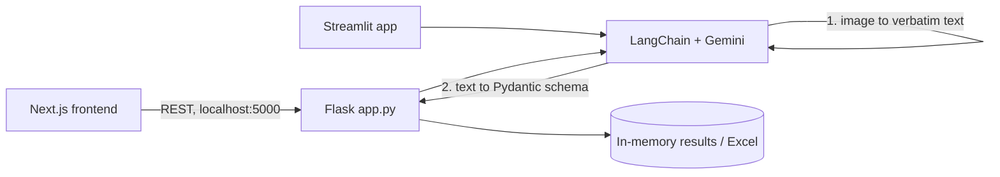

# Invoice Extraction Pro

Chat with invoice images and bulk-extract user-defined fields into an editable table and Excel export, powered by Google Gemini through LangChain.

## Problem

Invoices arrive in inconsistent layouts, so fixed-template OCR breaks easily. This project uses a multimodal LLM to read an invoice image, answer questions about it, and extract only the fields you define, across many files at once.

## Features

- **Invoice chat**: upload an invoice image. Gemini transcribes it verbatim, then suggests starter questions and answers follow-ups with per-session conversation memory.
- **Custom extraction schema**: define fields (name, type, description) in the UI. The backend turns them into a Pydantic model and uses it for structured LLM output.
- **Bulk processing**: upload several images, extract the same schema from each, review and edit results in a table, and download them as Excel.
- **Runtime API key**: the Gemini key can be set from the UI or an environment variable.
- **Two interfaces**: a Flask API with a Next.js frontend, and a standalone Streamlit app with the same chat and bulk-extraction flows.
- **Sample images** for quick demos (`backend/demo_images/`, `frontend/public/`).

## Tech stack

- **LLM**: Google Gemini via `langchain-google-genai` (default model `gemini-2.5-flash` from `.env`)
- **Backend**: Python, Flask, Flask-CORS, LangChain (`LLMChain`, `ConversationBufferMemory`), Pydantic, pandas, openpyxl
- **Frontend**: Next.js 15 (static export), React 19, Tailwind CSS, axios, framer-motion, react-markdown
- **Alternative UI**: Streamlit
- **Packaging**: Dockerfiles for backend (Python 3.11) and frontend (Node 18 build, served by nginx)

## Architecture

Two-step pipeline: image -> Gemini transcription -> Gemini structured output.



Chat sessions, schemas, jobs and results are held in in-process dictionaries. Nothing is persisted.

## Project structure

```
backend/
  app.py              Flask API (chat, schema, bulk extraction, Excel export)
  streamlit_app.py    Standalone Streamlit app
  requirements.txt
  Dockerfile
  demo_images/        Sample invoices
  notebooks/          Early experiments
frontend/
  src/app/imagedest/  Invoice chat page
  src/app/bulkimgpro/ Bulk extraction page
  src/app/components/ Navbar (API key dialog), editable results table
  Dockerfile, nginx.conf
```

## Setup

Prerequisites: Python 3.11+ (the Dockerfile uses 3.11), Node 18+, and a Google Gemini API key.

### Backend (Flask)

```bash
cd backend
pip install -r requirements.txt
```

Create `backend/.env`:

```
GOOGLE_API_KEY=your-gemini-key
MODEL=gemini-2.5-flash
FLASK_SECRET_KEY=change-me   # optional
```

```bash
python app.py
```

The frontend expects the API at `http://127.0.0.1:5000`. Confirm the server's port in `app.py` before running.

### Frontend (Next.js)

```bash
cd frontend
npm install
npm run dev     # http://localhost:3000
```

API URLs are hardcoded to `localhost:5000` / `127.0.0.1:5000` in the frontend source.

### Streamlit (alternative)

```bash
cd backend
streamlit run streamlit_app.py
```

The key is read from `GOOGLE_API_KEY`, Streamlit secrets, or the sidebar. The sidebar offers `gemini-1.5-flash` and `gemini-2.5-flash-preview-04-17`.

## Usage

1. Open **Invoice chat**, upload an invoice image, and ask questions or pick a suggested one.
2. Open **Bulk extraction**, define the fields you need, upload multiple invoices, and run extraction.
3. Edit the results in the table and download the Excel file.

## Limitations and future work

- Image inputs only. The code handles images, and PDF support is not implemented.
- The Flask `/` route renders `index.html`, but no `templates/` directory exists. Use the Next.js frontend or Streamlit.
- State is in memory only, so restarting the server loses sessions and jobs.
- Extraction schemas are turned into Python code and run with `exec`. This is unsafe for untrusted users and should be replaced with `pydantic.create_model`.
- No authentication, tests, or CI. API URLs in the frontend are hardcoded.
- The repo root `readme.md` is out of date and describes features (PDF support, export to accounting software) that the code does not implement.
- The committed `backend/.env` should be removed and the key rotated (see VERDICT.md).
- Future work: PDF input, persistent storage, configurable API base URL, tests, safer schema handling.
